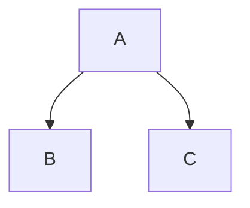

# The Ultimate Markdown Syntax Guide

## Table of Contents

- [The Ultimate Markdown Syntax Guide](#the-ultimate-markdown-syntax-guide)
  - [Table of Contents](#table-of-contents)
  - [Headers](#headers)
  - [Emphasis](#emphasis)
  - [Lists](#lists)
    - [Unordered Lists](#unordered-lists)
    - [Ordered Lists](#ordered-lists)
    - [Task Lists](#task-lists)
  - [Links](#links)
    - [Basic Link](#basic-link)
    - [Reference-style Links](#reference-style-links)
    - [URLs and Email Addresses](#urls-and-email-addresses)
  - [Images](#images)
  - [Code](#code)
    - [Inline Code](#inline-code)
    - [Code Blocks](#code-blocks)
  - [Tables](#tables)
  - [Blockquotes](#blockquotes)
  - [Horizontal Rules](#horizontal-rules)
  - [Line Breaks](#line-breaks)
  - [Extended Syntax](#extended-syntax)
    - [Footnotes](#footnotes)
    - [Definition Lists](#definition-lists)
    - [Emoji](#emoji)
    - [Mathematical Expressions](#mathematical-expressions)
    - [Highlighting](#highlighting)
    - [Subscript and Superscript](#subscript-and-superscript)
    - [Abbreviations](#abbreviations)
    - [Custom IDs](#custom-ids)
    - [Comments](#comments)
    - [Diagrams](#diagrams)
    - [Admonitions](#admonitions)
    - [Details/Disclosure](#detailsdisclosure)
    - [Keyboard Keys](#keyboard-keys)
    - [Description Lists](#description-lists)
    - [Metadata/Front Matter](#metadatafront-matter)
  - [Escaping Characters](#escaping-characters)

## Headers

Use `#` symbols for headers. More `#` symbols mean lower-level headers.

<!-- # Heading 1 -->

## Heading 2

### Heading 3

#### Heading 4

##### Heading 5

###### Heading 6

<!-- Alternative syntax for Heading 1 and 2:

Heading 1
=========

Heading 2
--------- -->

## Emphasis

Different ways to emphasize text:

*Italic text* or [example commented out]
<!-- _italic text_ -->

**Bold text** or [example commented out]
<!-- __bold text__ -->

***Bold and italic***
<!-- ___bold and italic___ -->

~~Strikethrough text~~

## Lists

### Unordered Lists

- Item 1
- Item 2
  - Subitem 2.1
  - Subitem 2.2
    - Sub-subitem 2.2.1

### Ordered Lists

1. First item
1. Second item
   1. Subitem 2.1
   1. Subitem 2.2
1. Third item

### Task Lists

- [x] Completed task
- [ ] Incomplete task
- [ ] Another task

## Links

### Basic Link

[Link text](https://example.com "Optional title")

### Reference-style Links

[Link text][reference]

[reference]: https://example.com "Optional title"

### URLs and Email Addresses

<https://example.com>

<email@example.com>

## Images

Insert images with:


Reference-style:

![Alt text][image-reference]

[image-reference]: image-url.jpg "Optional title"

## Code

### Inline Code

Use single backticks for `inline code`

### Code Blocks

Use triple backticks for code blocks with optional language specification:

```python
def hello_world():
    print("Hello, World!")
```

<!-- Indented code blocks (4 spaces or 1 tab):

    def hello_world():
        print("Hello, World!") -->

## Tables

Create tables using pipes and hyphens:

| Header 1 | Header 2 | Header 3 |
| -------- | -------- | -------- |
| Cell 1   | Cell 2   | Cell 3   |
| Cell 4   | Cell 5   | Cell 6   |

Alignment:

| Left | Center | Right |
| :--- | :----: | ----: |
| Left | Center | Right |

## Blockquotes

> This is a blockquote
>
> > Nested blockquote
> >
> > > Deep nested blockquote

## Horizontal Rules

Three or more hyphens, asterisks, or underscores:

---

<!-- ***

___ -->

## Line Breaks

End a line with two or more spaces  
to create a line break.

Or use the HTML break tag:  
New line.

## Extended Syntax

Note: Some features might need to be enabled in your Markdown processor.

### Footnotes

Here's a sentence with a footnote[^1].

[^1]: This is the footnote content.

### Definition Lists

Term
: Definition 1
: Definition 2

### Emoji

Some Markdown processors support emoji shortcodes:

:smile: :heart: :thumbsup:

### Mathematical Expressions

Some Markdown processors support LaTeX-style math:

$E = mc^2$

### Highlighting

Some processors support ==highlighted text==

### Subscript and Superscript

H~2~O (subscript)

X^2^ (superscript)

### Abbreviations

*[HTML]: Hyper Text Markup Language

The HTML specification is maintained by W3C.

### Custom IDs

### My Heading {#custom-id}

### Comments

[//]: # (This is a comment that won't appear in the output)

### Diagrams



### Admonitions

!!! note
    This is a note admonition

!!! warning
    This is a warning admonition

### Details/Disclosure
<!-- markdownlint-disable MD033 -->
<details>
<summary>Click to expand</summary>

Hidden content goes here

</details>

### Keyboard Keys

<kbd>Ctrl</kbd> + <kbd>C</kbd>

### Description Lists

<dl>
  <dt>Term</dt>
  <dd>Description</dd>
</dl>

### Metadata/Front Matter

```yaml
---
title: Document Title
author: Author Name
date: 2024-10-19
---
```

## Escaping Characters

Escape special characters with backslash:

- \* asterisk
- \_ underscore
- \` backtick
- \{ \} curly braces
- \[ \] square brackets
- \( \) parentheses
- \# hash mark
- \+ plus sign
- \- minus sign
- \. dot
- \! exclamation mark
